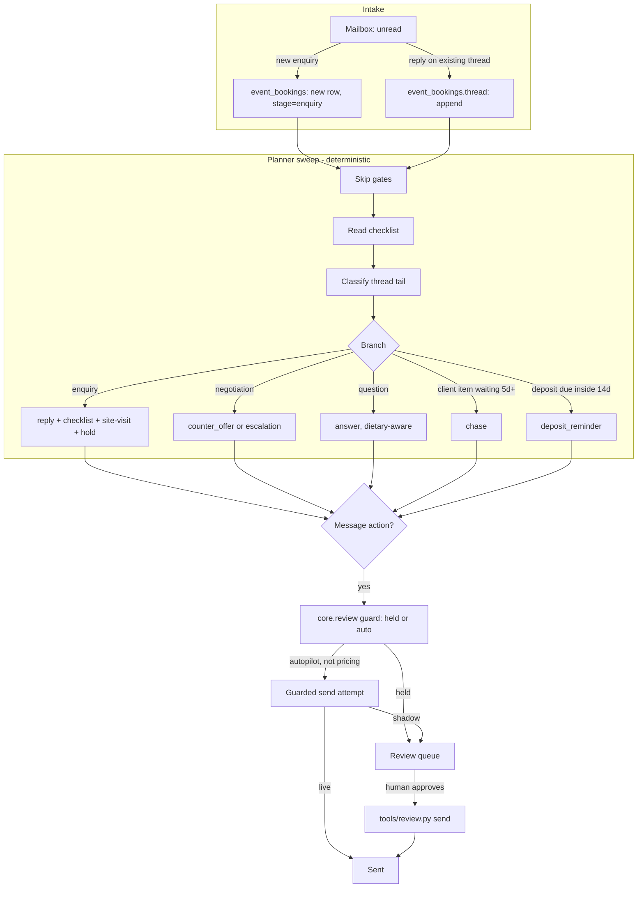

# Event & Wedding AI — "The Event Planner"

Owns the whole event once someone wants to hold it here — weddings,
conferences, offsites, board meetings.

## What it does

Owns the whole event once someone wants to hold it here — weddings,
conferences, offsites, board meetings. It runs the long sales cycle in one
thread with every stakeholder (the couple, the planner, procurement,
vendors), works from a per-event-type checklist so nothing gets forgotten,
reads the function-space calendar and the seasonal price table before it
quotes, drafts and sends the proposal and the BEO, organises the site visit,
chases whoever went quiet, and negotiates inside the band you set. Runs in
co-pilot (every send waits for your OK) or autopilot (routine sends go out
on their own — pricing still comes to you).

## What it won't do

Won't sign contracts, won't discount beyond the approved band, and any
custom price is held for human sign-off — in autopilot too.

## Why it matters

Events are huge revenue but enormous manual effort with slow follow-up;
most leads go cold.

## What to expect

Faster proposals + relentless follow-up, and a checklist-driven plan for
every event type from first enquiry to the run-sheet; recover a chunk of
the ~50% of event inquiries that go stale. Roster target: **+25% event
leads recovered** (revenue). See `docs/benefits.md` for what this template
actually measures versus what is aspirational.

## Who it's for

Any hotel or restaurant with function space to sell — a single private
dining room, a ballroom and a terrace, or a full conference floor. It fits
a property that already runs an events desk by hand (a spreadsheet, a
shared inbox, sticky notes on who to chase) and wants the checklist, the
diary and the quote kept honest without hiring another coordinator. It
also fits a restaurant that only occasionally hosts private dinners or
exclusive-use bookings — see "Restaurant install" under **Customising**
below.

## How it works



Full data flow, the modes, and every branch's exact rule:
`docs/how-it-works.md`.

**Shadow by default.** The agent reads, thinks, drafts and queues. It never
sends and never writes anywhere outside its own database until you flip
`mode: live` — see "Go live" below.

**Co-pilot or autopilot.** A second, independent switch
(`config/agent.yaml: autopilot`). Co-pilot holds every message for you.
Autopilot lets a *routine* message attempt to send itself — a negotiation
counter-offer is always held, in both.

### What runs when

| Job | Cadence | Command |
|---|---|---|
| Intake | every 15 minutes | `python3 tools/run.py --once --intake` |
| Planner sweep | daily at 07:30 | `python3 tools/run.py --once` |
| Review digest | daily at 08:00 | `python3 tools/report.py --digest` |
| Event Outreach tick (if enabled) | daily at 09:00 | `python3 tools/outreach.py tick` |

`make schedule ARGS="--all"` prints a ready-to-install snippet for every job
above, read straight from `config/agent.yaml: schedule:`.

### Sub-agent folded into this repo

**Event Outreach AI ("The Rainmaker")** — off by default. Fills the
calendar by going outbound instead of waiting for enquiries. See "Sub-agents
in this repo" below and `docs/sub-agents.md`.

### The data model, briefly

Nine tables in `data/agent.db` (SQLite, alongside `core.store`'s own
`items`/`events`/`runs`): `event_bookings` (one row per event — name, type,
stage, the seasonal quote inputs, the full thread), `event_checklist_items`
(owner + status, per event), `event_spaces` and `event_rates` (your venue
and prices, re-seeded from `config/agent.yaml` on every run — edit the
config, not the table), `event_space_days` (the diary — sparse, no row
means free), `event_documents` (BEO/proposal versions, never edited in
place), `event_state` (the day cursor), `event_runs` (one row per sweep).
Every date in the engine is an integer offset from the day cursor, exactly
like the demo platform this template is ported from — see
`docs/how-it-works.md` for why that matters for a safe re-run.

## What you need

| Thing | Required for | Time |
|---|---|---|
| Nothing | `make demo` | 5 minutes |
| A mailbox via IMAP (any provider, an app password) | Real intake + real sends | 15 minutes - **start here**, see `docs/integrations.md` |
| Gmail instead (a Google Cloud Console OAuth client) | Real intake + real sends, if you specifically want Gmail's own adapter | 30-45 minutes, outside Claude Code entirely - see `docs/integrations.md` |
| Your own venue list and rate card | Anything beyond the demo | 15 minutes |
| A Claude Code subscription, or an Anthropic API key | Real reasoning (intake classification, the desk note) | Already have one? 0 minutes |
| WhatsApp via your own UniPile account (optional) | Event Outreach AI's WhatsApp step, staff escalation pings | 20 minutes |

Nothing above is required to see the whole loop working — that is what
`make demo` is for.

## Quick start (5 minutes, no credentials)

```bash
git clone https://github.com/th1-ai/event-wedding-ai.git event-wedding-ai
cd event-wedding-ai
make setup
make demo
```

You should see the inbox read (one brand-new wedding enquiry opened, one
reply filed onto an existing dinner event, one message flagged for a
human), then a planner sweep across five events already in flight, ending:

```
8 action(s) across 4 event(s) - 0 sent, 6 awaiting approval, 2 left alone.
Desk note: The sweep answered the dietary question on the Whitfield
wedding and chased the outstanding photographer decision, offered a new
wedding enquiry two nearby dates with a seven-day hold on both, and
reminded the Marnix Group board meeting that its deposit is still
outstanding. The Solberg Analytics counter-offer is drafted and held for
you, as pricing always is, in either mode. Three events needed nothing
this time: one is done, one runs tomorrow, and the new enquiry's
checklist and site-visit offer are ready alongside the reply.

1 item(s) need a person to look first (an ambiguous inbound message
always does - see docs/safety.md).
Nothing was sent: mode is shadow, and a counter-offer is held in every
mode.
Next: `make review` to see the drafts, or read workflows/10-planner-sweep.md.

DEMO OK — 9 items processed, 7 drafted, 0 sent (shadow)
```

Nothing was sent anywhere — `make demo` always runs on `mock` adapters in
`mode: shadow`, whatever your own config says.

## Set up with Claude Code

Open `claude` in this folder for each phase and paste the prompt. Claude
follows the named workflow file, which has the exact commands and what to
check.

**Phase 1 — first run.**
> Read `workflows/00-setup.md` and walk me through it. I have not run
> `make setup` yet.

**Phase 2 — the property and the venue.**
> Read `workflows/00-setup.md` steps 3-5. Help me fill in
> `config/hotel.yaml`, `knowledge/property.md`, and — this is the important
> one — `config/agent.yaml`'s `spaces:` and `rates:` with my own function
> spaces and prices, not the sample ones.

**Phase 3 — connect a mailbox.**
> Read `docs/integrations.md`. I want to connect [my mailbox provider /
> Gmail]. Help me set the `.env` variables and confirm it with `make doctor`.

**Phase 4 — run it for real, in shadow.**
> Read `workflows/10-planner-sweep.md`. Run intake, then the sweep, and walk
> me through what is in the review queue.

**Phase 5 (optional) — Event Outreach AI.**
> Read `workflows/20-event-outreach.md`. I want to try outbound event
> prospecting. Walk me through it on the sample data first.

**Phase 6 — go live, when ready.**
> Read `workflows/90-go-live.md`. Check the checklist against where we
> actually are, and tell me honestly what is still missing.

## Connect your systems

| System | Adapter | Status | What it needs |
|---|---|---|---|
| Email | `mock` / `imap` / `gmail` | universal / built | `.env`: `EMAIL_ADDRESS`, `EMAIL_PASSWORD` (an app password), `IMAP_HOST`, `SMTP_HOST` — or a Google OAuth desktop client for `gmail`. |
| Messaging | `mock` / `unipile` / `webhook` | universal / built | Only used for a staff nudge when a negotiation escalates with the band off, and by Event Outreach AI for WhatsApp. `.env`: `UNIPILE_DSN`, `UNIPILE_API_KEY`, `UNIPILE_ACCOUNT_ID`. |
| Sheets | `csv` / `google` | universal / built | Not wired into a tool yet in this template — available for a future pipeline export. |
| PMS | `mock` / `csv` / `cloudbeds` / `cli` | universal / built | **Not used by the core loop.** The venue diary and rate card are this agent's own data — see `docs/how-it-works.md`. |

Full detail, env vars, and the "implement your own" recipe:
`docs/integrations.md`. Test any of the above:

```bash
make doctor
```

**LinkedIn and Instagram have no adapter in this family.** Event Outreach
AI's LinkedIn/Instagram steps are logged for the funnel table only — see
`docs/sub-agents.md`.

## Run it

```bash
make run                          # the planner sweep, one pass
make run ARGS="--intake"          # read mail, open/file events
make run ARGS="--dry-run"         # compute and print, write nothing
make watch                        # keep running on the configured interval
make review                       # what is waiting for a human
python3 tools/review.py show <id>
python3 tools/review.py approve <id>
python3 tools/review.py send
```

Full detail: `workflows/10-planner-sweep.md` and `workflows/80-review.md`.

### Scheduling

`make schedule ARGS="--all"` prints one snippet per job in
`config/agent.yaml: schedule:`, for cron (Linux/a VPS), `launchd` (Mac), or
`systemd` (Linux, timer units) — see `scheduler/*.example` for the templates
it fills in.

### Subscription or API

`llm.provider: interactive` (the default) costs nothing beyond your
existing Claude Code session and is the best way to see how intake and the
desk note reason. `claude-code` runs the same thing headless, on your own
subscription, for a scheduled job — subject to Anthropic's usage policy for
automated use; read `docs/safety.md`. `anthropic` (your own API key) is the
right choice for production volume and gives you a proper spend number via
`make report`.

## Go live

The full checklist, and exactly what changes, is `workflows/90-go-live.md`.
In short:

1. Real property details in `config/hotel.yaml`, your own venue and rates
   in `config/agent.yaml`, real knowledge files.
2. A few real days through the review queue, not just the demo.
3. `python3 tools/review.py stale` to clear the shadow-era backlog.
4. `mode: live` in `config/hotel.yaml`.

Approved drafts now send when you run `python3 tools/review.py send`. A
`counter_offer` is unaffected by any of this — it is always held, checked
in code before any config is even consulted. Autopilot auto-sending routine
messages for real is a further, separate step covered in the same workflow.

## Guardrails & safety

Full detail: `docs/safety.md`. In brief, this agent will never:

- Sign a contract, or take any action that would count as one.
- Discount beyond `negotiation_band_pct` (8% by default) — and a
  counter-offer is always held for a human, in co-pilot and autopilot,
  in shadow and in live.
- Offer a date it has not protected with a diary hold in the same sweep.
- Chase a vendor directly — a chase always goes to the first non-vendor
  stakeholder.
- Quote off memory — every price traces back to
  `config/agent.yaml: rates:` through one function,
  `tools/pricing.py` (`build_quote()`).
- Send anything while `mode: shadow`, or send an unapproved item that needs
  approval.

**Data handling.** Card numbers are redacted on ingestion
(`core/redact.py`), always on. Everything lives in `data/agent.db` on your
own machine — no telemetry, no TH1 service in the loop.

**AI disclosure.** `knowledge/signature.md` carries the line every outbound
email is signed with:

> This reply was prepared with AI assistance and reviewed by our team
> before it was sent. Reply to this message any time to reach a person
> directly.

Relevant to the EU AI Act Article 50 guest-transparency requirement, and
good practice everywhere.

## Sub-agents in this repo

### Event Outreach AI ("The Rainmaker") — off by default

**Does.** Fills the event calendar by going outbound. It watches signal
sources for buying triggers (a company opened an office nearby, a hiring
burst, a conference bringing 2,400 people to town), finds verified contacts
via Hunter.io and Findymail for cents per lead, then runs multi-day
sequences — profile visit, post like, a personalised connection note under
300 characters, messages and emails with AI hooks written from each lead's
own trigger, WhatsApp once a thread exists — all inside safe per-account
daily caps with email warm-up and SPF/DKIM/DMARC watched.

**Won't.** Hands warm replies to a human or the Event & Wedding AI to
close, stops every sequence the moment someone answers, and respects
do-not-contact and anti-spam rules.

**Why.** Event revenue is high-margin, but most hotels only wait for
inbound. This goes and gets it.

**Output.** Builds a steady pipeline of qualified event leads from the
local market.

```bash
python3 tools/outreach.py seed-demo     # try it before connecting a real signal feed
python3 tools/outreach.py signals
python3 tools/outreach.py enrich
python3 tools/outreach.py campaign generate camp-01 --avatar mice
python3 tools/outreach.py campaign launch camp-01
python3 tools/outreach.py tick --days 8
python3 tools/outreach.py funnel camp-01
python3 tools/outreach.py inbox
```

A launched campaign's routine sends are not queued item-by-item for review
the way the main loop's are — launch itself is the approval. Full detail,
what is simplified relative to the source spec and why, and every
guardrail: `docs/sub-agents.md` and `workflows/20-event-outreach.md`.

## Customising

- **`knowledge/`** — property facts, FAQ, the pricing policy narrative, the
  venue reference sheet, the email signature. Copy the matching example
  file for each (see `workflows/00-setup.md` step 3) and edit; see
  `knowledge/README.md`.
- **`config/agent.yaml`** — the real operating data: `spaces:`, `rates:`,
  `checklist_templates:`, the seven `rules:`, the negotiation band, the
  chase and deposit windows, the site-visit slots.
- **`prompts/`** — `prompts/intake.md` (new-enquiry classification) and
  `prompts/desk_note.md` (the cosmetic summary). Plain markdown with `{{vars}}`.
- **Adding a language.** `core/i18n.py` covers `en fr de es it pt nl sv`
  out of the box for date formatting; the classification regexes in
  `tools/textmatch.py` are English-only — `tools/intake.py`'s model call is
  where a non-English message should really be understood, and a message
  in a language the hotel does not list under `hotel.languages` is queued
  `needs_human` rather than guessed at.

### Restaurant install

Trim `config/agent.yaml: spaces:` to a private dining room and a
`whole-venue` row, drop `wedding_saturday_uplift`/`uplift_spaces`, and use
the `offsite` or `meeting` checklist templates for a private dinner or a
launch party. `tools/beo.py` (`build_beo()`) needs no code change — call the
artefact the kitchen running order instead of a BEO if you like; the
dietary callout is the section that matters most. See
`knowledge/event-spaces.md` for a worked example.

## Troubleshooting & FAQ

Full list: `workflows/99-troubleshooting.md`. The most common ones:

- **`make doctor` shows `FAIL: hotel identity`** — expected on a fresh
  clone; edit `config/hotel.yaml`.
- **`make run` exits with code 3** — not an error. `llm.provider:
  interactive` is waiting for an answer in `data/pending/`.
- **A reply appeared instead of the counter-offer I expected** — the
  engine reads only the newest thread message every sweep; a later,
  unrelated message can "bury" an earlier discount ask. Not a bug — see
  `docs/how-it-works.md` "Guardrails".
- **Event Outreach `tick` shows 0 sent** — check `mode`; shadow blocks
  every real send exactly like the main loop.
- **"Why did it offer a date, not just decline?"** Branch A always tries
  the six nearest alternates (`alt_date_steps` in `config/agent.yaml`)
  before giving up, and holds the first two that are genuinely free across
  every requested space — see `docs/how-it-works.md`.
- **"Can I raise the negotiation band for one difficult client?"**
  `negotiation_band_pct` is global, applied to every future counter. A
  one-off exception is a human decision made in the review queue (edit the
  draft, or reject it and handle it by hand) — not a config change, which
  would quietly loosen it for everyone from then on.
- **"Does the checklist ever tick itself off?"** Only `qualify`, the moment
  `checklist_build` runs. Everything else needs a human action in the
  review queue or a real reply moving the event forward — see
  `docs/benefits.md`.
- **"What happens to my `config/agent.yaml` edits when the repo updates?"**
  Nothing in `config/` is ever overwritten by a sync — only
  `config/*.example.yaml` ships fresh; your own `config/hotel.yaml` and
  `config/agent.yaml` are yours, and gitignored.

## Measuring the benefit

Full detail and honest caveats: `docs/benefits.md`. In short:
`python3 tools/report.py` for pipeline value, checklist completion, and the
review queue's edit rate; `python3 tools/report.py --digest` for a one-line
daily summary; `python3 tools/outreach.py funnel <id>` for the outbound
pipeline, if you have turned that on.

## About

Built by [TH1](https://th1.ai) — AI agents for independent hotels and
restaurants. This repo is free to use, modify, and run yourself under the
MIT license (see `LICENSE`). Want it set up, run, and maintained for you
instead? [th1.ai](https://th1.ai) does that too.

**Changelog**
- v1.0 — initial release: the planner sweep, intake, Event Outreach AI
  folded in.
