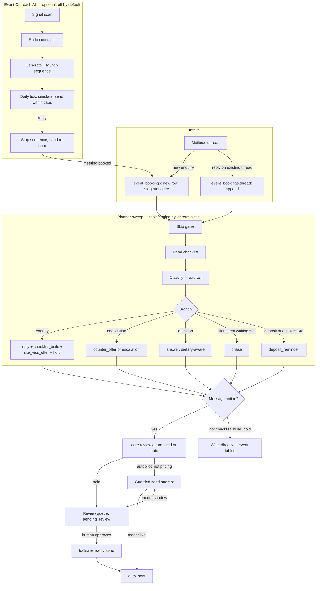

# How Event & Wedding AI works

## The two loops

**The planner sweep** (`tools/run.py`, `tools/engine.py`) is the agent's main job.
It reads every open event, the checklist, the space diary and the rules, and
decides what to do next — deterministically. Nothing here is a model call.

**The desk note** (`tools/run.py` → `core.llm.complete`) is the one place a model
runs at all: a 3-4 sentence cosmetic summary of what the sweep just did. It never
decides anything and its failure never blocks a run.

**Intake** (`tools/intake.py`) is the one addition this template makes beyond the
demo it is built from: the demo starts from event rows that already exist, fully
formed. A real hotel's mailbox does not arrive that way, so intake reads unread
mail, uses one small classification model call to decide "new enquiry" vs "reply
on an existing event", and either opens a new event at stage `enquiry` or files
the message onto the matching event's thread. See "Design decisions" below.

**Event Outreach AI** ("The Rainmaker", `tools/outreach.py`) is a second, optional
loop folded into this repo (see `docs/sub-agents.md`). It fills the calendar with
enquiries instead of waiting for them, and hands a booked meeting to this agent's
own event table at stage `enquiry` — the same shape Branch A already knows how to
work.

## Data flow



## Modes: shadow/live, and co-pilot/autopilot

Two independent switches, both real:

1. **`mode: shadow` / `mode: live`** (`config/hotel.yaml`) — the platform-wide
   kill switch every repo in this family ships with. Shadow means nothing ever
   leaves the building; `core.review.assert_write_allowed` blocks every guarded
   write, approved or not. This agent adds nothing on top — the guard is the
   guard.
2. **`autopilot: true/false`** (`config/agent.yaml`) — this agent's own knob,
   matching the roster promise: co-pilot ("every send waits for your OK") vs
   autopilot ("routine sends go out on their own — pricing still comes to you").

The engine computes a `held` flag per action, independent of `mode`:

```
counter_offer (pricing)   -> held = True, always, in both co-pilot and autopilot
no autopilot (co-pilot)   -> held = True
autopilot, not pricing    -> held = False
```

`held = True` means the item is queued `pending_review` and needs a human.
`held = False` means `tools/run.py` attempts to send it straight away — and
**that attempt still goes through the same guarded write as everything else.**
In `mode: shadow` (the default, and what `make demo` always forces) that attempt
is blocked and the item falls back to `pending_review` instead of `auto_sent`.
This is why the demo's summary line always ends `0 sent (shadow)` even with
autopilot on: shadow beats autopilot, exactly as it beats everything else.

## What runs when

| Workflow | Cadence | Provider calls |
|---|---|---|
| Planner sweep (`tools/run.py --once`) | daily, morning | 0 (pure logic) + 1 desk note |
| Intake (`tools/run.py --once --intake`, or folded into the sweep) | every 15 min | 1 per new thread (classify) |
| Event Outreach: signal scan / enrich | on demand, or scheduled weekly | 0 |
| Event Outreach: daily tick | daily | 0 (+ 1 desk note) |
| Hold-expiry check | folded into the sweep | 0 |
| Review digest | daily, `review.digest_hour` | 0 |

Full commands and cadence: `config/agent.yaml: schedule:`, printed exactly by
`make schedule ARGS="--all"`.

## Data model

Nine tables, via `store.migrate()` in `tools/store_ext.py`, alongside `core.store`'s
own `items`/`events`/`runs`:

- `event_bookings` — one row per event. `stage` moves enquiry → proposal →
  negotiation → contracted → planning → ready → done, never backwards.
- `event_checklist_items` — per-event tasks, `owner` ai/hotel/client, `status`
  todo → waiting → done, never backwards.
- `event_spaces` — the venue inventory, seeded once from `config/agent.yaml:
  spaces:` (edit the config, not the table).
- `event_space_days` — the diary. **Sparse: no row means free.** A `held` row
  lapses back to free after `hold_expiry_days`; a `booked` row is external and
  never touched by the agent.
- `event_rates` — the price list, seeded once from `config/agent.yaml: rates:`.
- `event_documents` — BEO versions. Regenerating inserts a new version; nothing
  is ever edited in place, so the run sheet ops works from is always the one
  that was actually sent.
- `event_state` — one row: the demo/production day cursor.
- `event_runs` — one row per sweep, for `tools/report.py`.
- `outreach_*` — Event Outreach AI's own tables (leads, campaign, steps, sent
  events, inbox messages). See `docs/sub-agents.md`.

Every date in the engine is an **integer offset from `event_state.day_cursor`**,
exactly like the demo it is built from — this is what makes a re-run safe and
what makes `advance_clock` (the "move N days" workflow step) predictable.

## Idempotency

- Checklist rows: `UNIQUE(event_ref, item_key)` — a sweep that runs twice never
  double-inserts a checklist.
- Space holds: `UNIQUE(space_slug, day_offset)` — same for holds.
- Message actions: each becomes a `core.store.Item` with
  `external_id = "{event_id}:{action_kind}:{day_cursor}"`, so a re-run on the
  same day never queues the same chase or the same counter-offer twice.
  `store.already_processed()` on top of that skips events untouched since the
  last real change.
- Sends: `store.claim_for_send()` is the single atomic claim; `mark_sent`
  records the provider message id before the transition, never after.

## Resumable stages

Intake's classify call can pend on the `interactive` provider. The item stores
its cached classification (`payload["_classify_cache"]`) the moment it succeeds,
so a re-run after answering the prompt resumes at "file the message", not at
"classify again" — the same pattern `docs/how-it-works.md` in the reference
agent documents for its own two-stage draft.

## Guardrails carried over from the spec, unchanged

- **A price never sends itself.** `counter_offer` is always held, in both
  co-pilot and autopilot, in shadow and in live. `negotiation_band_pct` (8% by
  default) is a hard ceiling, never split with a bigger ask.
- **Band off = no draft at all.** With `rules.negotiation_band` off, the action
  is an internal `escalation` with no message — nothing is drafted, let alone
  sent.
- **One chase per item, ever.** Chases are keyed on the checklist item; the
  chase itself becomes the newest reference point, so the same item is never
  chased twice before someone answers.
- **Only client-owned, `waiting` items are chased**, and never a vendor
  directly — the first non-vendor stakeholder gets it.
- **Never offer a date that is not protected.** Every alternate date offered in
  a reply gets a hold in the same sweep.
- **Holds expire.** `hold_expiry_days` (7 by default) so a provisional hold
  cannot block real business forever.
- **Never quote off memory.** `tools/pricing.py:build_quote()` is the only
  place a price is computed, and the BEO and the pricing sheet call the same
  function — they cannot disagree.
- **Events that are today, tomorrow, already past or already `done` are left
  alone.** No checklist read, no chase, nothing.
- **Won't sign contracts.** No signature path exists anywhere in this repo.

## Design decisions (the spec said "not specified" or left an open question)

1. **Intake is new.** The demo engine takes fully-formed event rows as input;
   nothing in it parses a raw email into one. `tools/intake.py` adds one LLM
   call (`prompts/intake.md`, schema-validated) to decide new-enquiry vs
   reply-on-existing-thread and to extract type/pax/spaces for a new row. If
   the model is not confident, the item is queued `needs_human` rather than
   guessed — same rule as every other classification in this family.
2. **Event Outreach folds into this repo, not into a separate one**, per the
   brief. The spec (`specs/event-outreach-ai.md` §11.1) says the roster calls
   it a child of Event & Wedding AI while its demo page and engine sit inside
   the CRM cluster; the brief for this repo decided the roster reading. See
   `docs/sub-agents.md`.
3. **The outreach hand-off is real, not narrative.** The spec's own open
   question #2 (event-outreach-ai.md) says a qualified lead "ought to arrive as
   an `event_bookings` row at stage `enquiry`" and that "today nothing does
   that." Here it does: `tools/outreach.py:hand_off()` inserts the row and the
   next planner sweep picks it up through the ordinary Branch A path.
4. **Outreach's campaign state is persisted, not replayed.** The demo
   recomputes the whole campaign from scratch on every render because nothing
   in it really sends. A live agent cannot replay a real send — spec open
   question #2 flags this explicitly and asks a template to decide it
   deliberately. `outreach_events` records what actually fired; `tick()`
   advances from there rather than recomputing history.
5. **LinkedIn and Instagram touches are logged, not sent.** `core/adapters`
   has no LinkedIn or Instagram adapter (only email, WhatsApp/webhook chat, and
   PMS/sheets families exist). Those two step kinds are recorded in
   `outreach_events` as having happened, for the funnel table and the sequence
   logic, but no real send goes anywhere. `docs/integrations.md` says this
   plainly; wiring a real one is the documented stub recipe.
6. **Hunter.io / Findymail enrichment costs are simulated**, not a live API
   call — there is no core adapter for either and the brief does not name one
   to port. `tools/outreach.py:enrich_leads()` reproduces the cost arithmetic
   (per-provider EUR/lead, billed even on a miss) so the funnel numbers are
   honest about what a real integration would cost, without pretending to have
   built one.
7. **The function-space diary and the rate card are this agent's own tables**,
   not a PMS adapter call. The spec's own integrations table marks the
   room-block write and the site-visit calendar as "not implemented" in the
   demo; this template keeps the venue diary in `event_space_days` (seeded from
   `config/agent.yaml`, edited there) rather than pretending a banqueting-system
   adapter exists. `systems.pms` still ships (mock/csv/cloudbeds) for a future
   room-block write — see `docs/integrations.md`.
8. **The wording bug the spec flags (§11.4, "midweek peak-season business") is
   fixed here**, not ported: the counter-offer body only claims "midweek" when
   the event's day-of-week actually is midweek, and the season band it names is
   the one the event was actually quoted at.
9. **A proposal document is built alongside the BEO.** The spec (§11.1) flags
   that `does` promises a proposal but the demo never built one, only a
   checklist tick. `tools/beo.py:build_proposal()` renders one (venue, dates,
   quote line-by-line, attachments) — a plainer sibling of `build_beo()`, sent
   on the same `reply` action that used to just say "checklist item ticked".
10. **`season_band` is still seeded per event, not derived from a real
    calendar.** Doing that properly needs the hotel's own seasonal calendar,
    which does not exist yet in this template. `config/agent.yaml` documents
    where to add one; until then, treat `season_band` as a fact you set when
    you create the event, the same way the demo does.
11. **Checklist items only self-complete where the sweep itself does the
    work** (`qualify` on `checklist_build`). Everything else needs a human
    `tools/review.py` action or a scripted reply in the demo — there is no
    invented "mark done" automation the real spec does not support either.
12. **The restaurant lens (§10 in both specs) is not a separate build.** The
    same tables and the same engine serve a restaurant install: fewer spaces
    (drop the wedding-only uplift spaces), shorter checklist templates
    (offsite/meeting length), and the BEO becomes the kitchen running order.
    `docs/integrations.md` and `knowledge/event-spaces.example.md` show both a
    hotel-shaped and a restaurant-shaped `spaces:`/`rates:` block.
